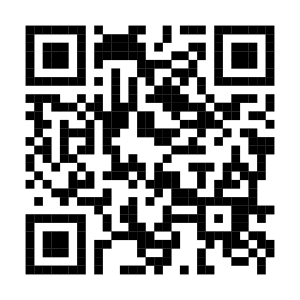
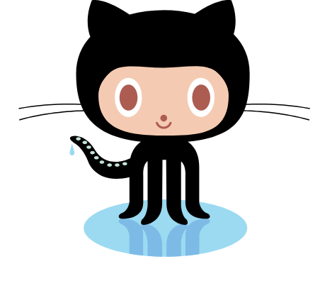
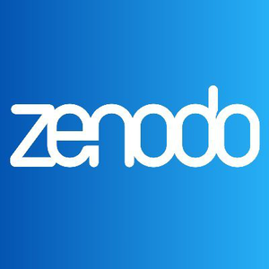
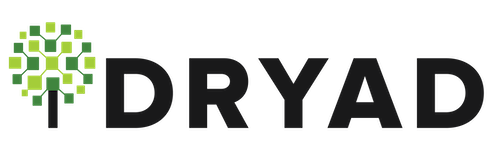
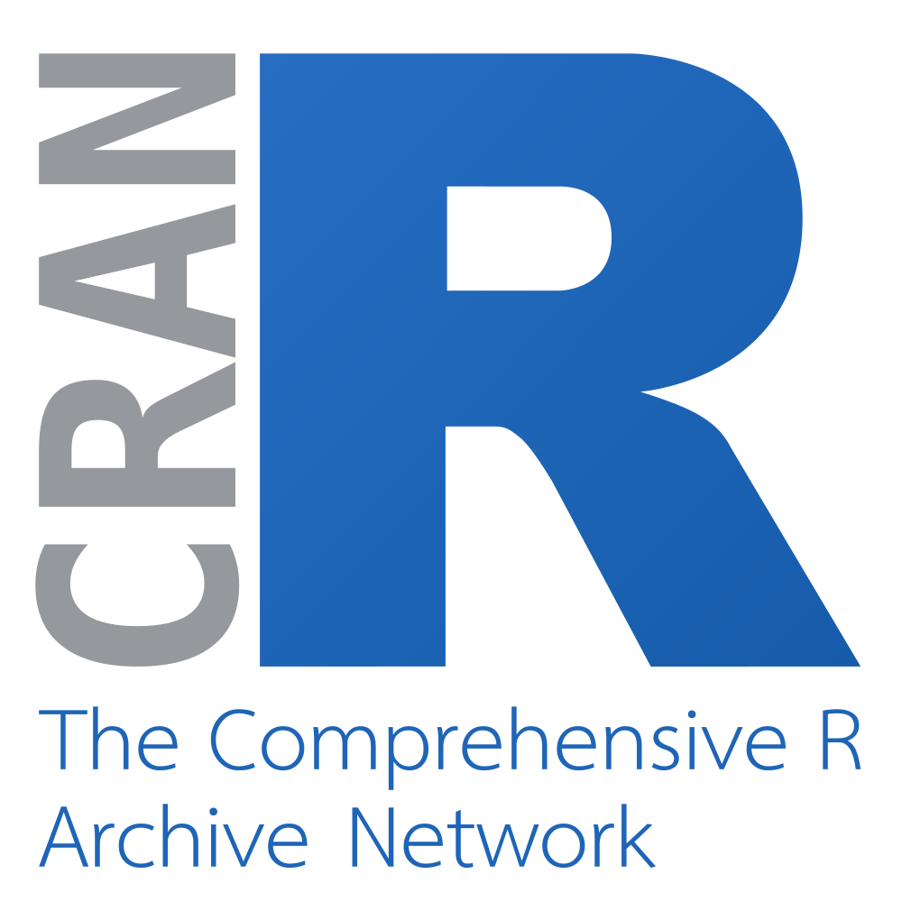
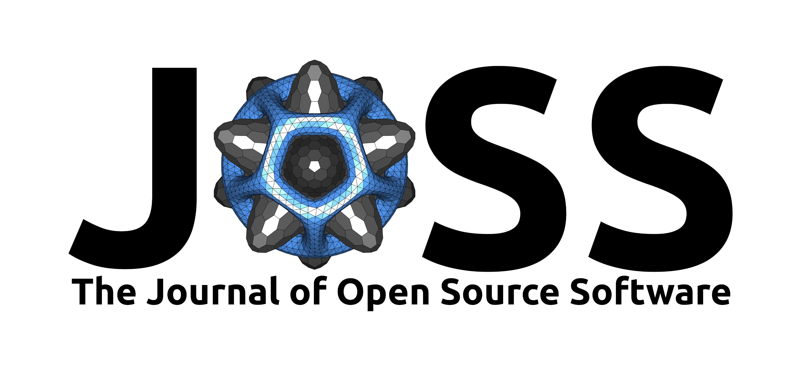

```{r}
#| include: false
url <- "https://debruine.github.io/talks/tool-credit-2026/"
subtitle <- sprintf("[%s](%s)", url, url)
# make QR code
qrcode::qr_code(url) |> qrcode::generate_svg("images/qrcode.svg")

library(tidyverse)
set_theme(theme_bw())
```
---
title: "Getting Credit for Tool Creation"
subtitle: "`r subtitle`"
author: "Lisa DeBruine  \n{width=300}"
format: 
  revealjs:
    logo: images/or_logo.png
    theme: [default, ../style.scss]
    transition: none
    transition-speed: fast
    df-print: kable
    code-annotations: select
execute:
  warning: false
---

```{r, include = FALSE}
knitr::opts_chunk$set(echo = TRUE)
```

# Abstract

This talk covers why and how you can get credit for your research software. Projects on GitHub or other repositories should contain a README, License, citation info, and stable releases. This can facilitate the creation of a DOI with Zenodo or other methods. Tools can also be described in a software paper. These objects can and should be included in Enlighten. 

## Why credit software?

* Transparency
* Funder requirements
* So you can cite your software
* So other people can find and use your software
* Responsible Recognition: We value diverse scholarly outputs beyond standard articles, including datasets, software, protocols, and code ([DORA](https://sfdora.org)) 


# GitHub

:::: {.columns}
::: {.column width="67%"}

* README
* Clear role descriptions with ORCiDs
* Explicit License
* CITATION.cff
* Releases

:::
::: {.column width="33%"}

:::
::::

## README

All projects should have a README that explains:

* What the software does
* How users can get started
* Where users can get help
* Who maintains and contributes

## Role Descriptions

* DESCRIPTION file of R package
* [CONTRIBUTORS.md](https://allcontributors.org)
* [CRediT Taxonomy](https://credit.niso.org/)

## License

* makes it available for future use by others
* allows others to understand if they can use, copy, modify, resell or distribute the software
* makes clear who is liable e.g. if something goes wrong with the software
* will increase the impact of your research through reuse and development by others
* [choose a license](https://choosealicense.com/licenses/)

## License Comparison {.smaller}

| License |Commercial use? | Open mods? | Patent? | Good choice when... |
|---|----|--------|----|-------------|
| **MIT**  | ✅ Yes | ❌ No | ❌ No | You want **simple, unrestricted reuse**. |
| **BSD 3-Clause**  | ✅ Yes | ❌ No | ❌ No | You want permissive reuse plus **non-endorsement protection**. |
| **Apache 2.0**  | ✅ Yes | ❌ No | ✅ Yes | You want permissive reuse plus **patent protection**. |
| **LGPLv3**  | ✅ Yes, with conditions | ⚠️ Changes must be open | ✅ Yes | You're releasing a **library** with weak copyleft. |
| **GPLv3**  | ⚠️ Yes, with conditions | ✅ Generally | ✅ Yes | You want **derivative software to remain open**. |
``

## CITATION.cff

``` yaml
cff-version: 1.2.0
message: "If you use this software, please cite it as below."

authors:
  - family-names: "DeBruine"
    given-names: "Lisa"
    orcid: "0000-0002-7523-5539"
title: "Faux"
version: 1.2.4
doi: 10.5281/zenodo.2669586
date-released: 2026-03-17
url: "https://github.com/scienceverse/faux"
```

## Releases

Use versioned GitHub releases such as v1.0.0, so there is an identifiable version corresponding to what someone actually used.

[GitHub Releases](https://docs.github.com/en/repositories/releasing-projects-on-github)

# Get a DOI

A Digital Object Identifier is a unique and permanent ID used to identify academic papers, journal articles, and other digital data objects.

## Zenodo

:::: {.columns}
::: {.column width="67%"}
* Get a [Zenodo](https://zenodo.org) account
* Link your GitHub account
* Sync your repositories
* Enable a repository
* Create a release on GitHub
* Get your Zenodo DOI(s) and badge
* Publish a new release for each version
:::

::: {.column width="33%"}

:::
::::

## Other Repositories

You can archive a version of your software in a repository that provides DOIs, such as [Figshare](https://figshare.com/) or [Dryad](https://datadryad.org/).

This is more suitable for software that is no longer maintained or under development.

::: {layout-ncol=2}



:::

## CRAN

:::: {.columns}
::: {.column width="67%"}

If you write R packages, accepted CRAN submissions now get a DOI automatically.

<https://doi.org/10.32614/CRAN.package.faux>

:::
::: {.column width="33%"}

:::
::::

## JOSS

:::: {.columns}
::: {.column width="67%"}

* [Journal of Open Source Software](https://joss.theoj.org/)
* Paper with software description
* Links to code repository
* Paper and code reviewed via GitHub issues
* [Submission](https://joss.readthedocs.io/en/latest/submitting.html)

:::
::: {.column width="33%"}

:::
::::

# Enlighten

Just like accepted papers, you should track your datasets, code, software, and any research object with a DOI on [Enlighten](https://researchdata.gla.ac.uk/deposit.html).


# Resources

* [Institute for Resaerch Software](https://www.software.ac.uk/)
* [FAIR Principles for research software](https://doi.org/10.1038/s41597-022-01710-x)
* [Code Refinery](https://coderefinery.org/)

# Thank You!

Getting Credit for Tool Creation

`r subtitle`

Lisa DeBruine

{width=300}

